# DBT Spark Operator - Kyuubi Pod Template Integration

## Architecture Overview

The `DbtSparkOperator` provides a **clean separation** between DBT execution and Spark resource management with **intelligent pod naming**:

### 🔄 **Two-Layer Resource Management**

```mermaid
graph TD
    A[Airflow DAG] --> B[DbtSparkOperator]
    B --> C[DBT Pod: 0.5 CPU, 1GB RAM]
    
    C --> D[Kyuubi Thrift Connection]
    D --> E[Kyuubi Server]
    E --> F[Creates Spark Pods via Templates]
    
    subgraph "DBT Layer"
        C --> G["DBT Command Execution"]
        C --> H["Host Mount: /opt/dbt → /dbt"]
    end
    
    subgraph "Spark Layer (Pod Templates)"
        F --> I["Driver: dbt-spark-analytics-pipeline-driver"]
        F --> J["Executor 1: dbt-spark-analytics-pipeline-exec-1"]
        F --> K["Executor 2: dbt-spark-analytics-pipeline-exec-2"]
    end
```



### 🏷️ **Intelligent Pod Naming Strategy**

The system now supports **dynamic pod naming** that incorporates DAG context:

**Before** (Generic naming):
```
dbt-spark-random-hash-exec-1
dbt-spark-random-hash-exec-2
```

**After** (Context-aware naming):
```
dbt-spark-analytics-pipeline-v2-exec-1
dbt-spark-analytics-pipeline-v2-exec-2
dbt-spark-marketing-dashboard-exec-1
```

### ⚙️ **Configuration Method**

Pod naming is controlled through **three configuration layers**:

#### 1. **DBT Profiles Configuration**
```yaml
# In DBT profiles.yml (generated dynamically)
spark_config:
  spark.kubernetes.executor.podNamePrefix: "dbt-spark-${AIRFLOW_DAG_ID}"
  spark.app.name: "${AIRFLOW_DAG_ID}-${AIRFLOW_TASK_ID}"
```

#### 2. **Kyuubi Environment Variables**
```yaml
# In kyuubi-dbt-deployment.yaml
env:
  - name: SPARK_KUBERNETES_EXECUTOR_POD_NAME_PREFIX_TEMPLATE
    value: "dbt-spark-{dag_id}-{model_name}"
  - name: SPARK_APP_NAME_TEMPLATE
    value: "{dag_id}-{task_id}"
```

#### 3. **Airflow Context Injection**
```python
# Environment variables passed to DBT pod
'AIRFLOW_DAG_ID': context['dag'].dag_id,           # "analytics_pipeline_v2"
'AIRFLOW_TASK_ID': self.task_id,                   # "run_staging_models"
'AIRFLOW_RUN_ID': context['run_id'],               # "manual__2024-01-15T10:30:00"
```

### 🎯 **Pod Naming Examples**

| DAG | Task | Generated Pod Names |
|-----|------|---------------------|
| `analytics_pipeline_v2` | `run_staging_models` | `dbt-spark-analytics-pipeline-v2-exec-1`<br>`dbt-spark-analytics-pipeline-v2-exec-2` |
| `marketing_dashboard` | `build_user_metrics` | `dbt-spark-marketing-dashboard-exec-1`<br>`dbt-spark-marketing-dashboard-exec-2` |
| `daily_reporting` | `generate_summary` | `dbt-spark-daily-reporting-exec-1`<br>`dbt-spark-daily-reporting-exec-2` |

### 🔧 **Resource Allocation**

| Component | CPU | Memory | Purpose |
|-----------|-----|--------|---------|
| **DBT Pod** | 250m | 512Mi | DBT command execution, Thrift connection |
| **Spark Driver** | 500m | 1GB | Spark job coordination (via pod template) |
| **Spark Executor** (x2) | 500m each | 1GB each | Spark task execution (via pod template) |
| **Total per Job** | 1.75 CPU | 3.5GB | Lightweight, efficient resource usage |

### 📊 **Operational Benefits**

✅ **Clear Observability**: Pod names immediately show which DAG/pipeline they belong to  
✅ **Easy Debugging**: `kubectl get pods | grep analytics-pipeline-v2`  
✅ **Resource Tracking**: Monitor resource usage per pipeline  
✅ **Automated Cleanup**: Pods are automatically cleaned up when DAG completes  
✅ **Conflict Prevention**: Unique naming prevents pod name collisions  

### 🚀 **Usage Example**

```python
# DAG definition
with DAG('analytics_pipeline_v2', ...) as dag:
    
    # This will create pods named: dbt-spark-analytics-pipeline-v2-exec-*
    staging_task = DbtSparkRunOperator(
        task_id='run_staging_models',
        dbt_select='tag:staging',
        dag=dag
    )
    
    # This will create pods named: dbt-spark-analytics-pipeline-v2-exec-*
    marts_task = DbtSparkRunOperator(
        task_id='run_marts_models',
        dbt_select='tag:marts',
        dag=dag
    )
```

### 🔍 **Monitoring Commands**

```bash
# View all DBT Spark pods for a specific pipeline
kubectl get pods -l app=dbt-spark | grep analytics-pipeline-v2

# Monitor resource usage for a specific DAG
kubectl top pods -l spark-app-name=analytics-pipeline-v2

# Check logs for a specific execution
kubectl logs dbt-spark-analytics-pipeline-v2-exec-1

# Debug failed executions
kubectl describe pod dbt-spark-analytics-pipeline-v2-exec-1
```

This architecture provides **production-ready data pipeline execution** with intelligent resource management, clear observability, and seamless integration with your existing Airflow DAGs. 