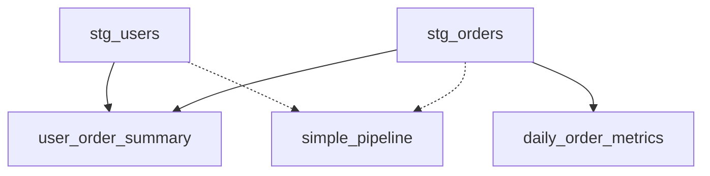

# DBT Analytics Project - Clean Architecture

## Overview
This DBT project follows **model-level configuration** best practices, where each model defines its own materialization, tags, and settings using `{{ config() }}` macros instead of centralized project-level configuration.

## Project Structure

```
dbt/analytics/
├── models/
│   ├── staging/           # Raw data transformations
│   │   ├── stg_users.sql
│   │   └── stg_orders.sql
│   ├── marts/             # Business-ready data marts
│   │   ├── user_order_summary.sql
│   │   └── daily_order_metrics.sql
│   └── simple_pipeline.sql  # Complete example pipeline
├── macros/                # Reusable SQL functions
├── tests/                 # Data quality tests
└── dbt_project.yml       # Project-wide settings only
```

## Configuration Philosophy

### ✅ Model-Level Configuration
Each model uses `{{ config() }}` to define:
- **Materialization**: `table`, `view`, `incremental`
- **File Format**: `iceberg` for lakehouse compatibility
- **Location**: Environment-specific paths using variables
- **Tags**: For organization and DAG selection
- **Schema Changes**: Handling strategy
- **Descriptions**: Self-documenting models

### ❌ No Project-Level Model Config
The `dbt_project.yml` contains **only**:
- Project metadata
- File paths
- Global variables
- Project-wide settings

## Model Types & Patterns

### 🔄 Staging Models
**Location**: `models/staging/`
**Purpose**: Clean and standardize raw data
**Pattern**: 
```sql
{{ config(
    materialized='table',
    file_format='iceberg',
    location_root=var('warehouse_path') ~ '/staging',
    tags=['staging', 'domain_name'],
    on_schema_change='fail'
) }}
```

### 📊 Marts Models
**Location**: `models/marts/`
**Purpose**: Business-ready analytics tables
**Pattern**:
```sql
{{ config(
    materialized='table',
    file_format='iceberg', 
    location_root=var('warehouse_path') ~ '/marts',
    tags=['marts', 'business_intelligence'],
    on_schema_change='fail',
    description='Business description'
) }}
```

### ⚡ Incremental Models
**Purpose**: Performance optimization for large datasets
**Pattern**:
```sql
{{ config(
    materialized='incremental',
    unique_key='date_column',
    file_format='iceberg',
    incremental_strategy='merge',
    tags=['incremental', 'performance']
) }}
```

## Environment Variables

The project uses variables for environment-specific configuration:

```yaml
# dbt_project.yml
vars:
  warehouse_path: "s3a://warehouse"  # Overridden by environment
  environment: "dev"                 # dev, staging, prod
  enable_profiling: true             # Environment-specific
  sample_size: 1000                  # For development
```

## Tag-Based Selection

Models are organized with tags for easy selection:

```bash
# Run all staging models
dbt run --select tag:staging

# Run all marts
dbt run --select tag:marts  

# Run incremental models only
dbt run --select tag:incremental

# Run business intelligence models
dbt run --select tag:business_intelligence
```

## Model Dependencies



## Key Benefits

### 🎯 **Self-Contained Models**
- Each model defines its own behavior
- No need to cross-reference multiple files
- Easy to move models between projects

### 🔍 **Clear Intent**
- Configuration is co-located with logic
- Easier code reviews and debugging
- Self-documenting through descriptions

### 🌍 **Environment Flexibility**
- Variables allow environment-specific paths
- Easy promotion between dev/staging/prod
- Consistent behavior across environments

### ⚡ **Performance Optimization**
- Incremental models with proper strategies
- Iceberg format for lakehouse performance
- Optimized for Spark/Kyuubi execution

## Usage Examples

### Development Workflow
```bash
# Install dependencies
dbt deps

# Test connection
dbt debug --target dev

# Run specific model
dbt run --select simple_pipeline

# Run and test staging
dbt run --select tag:staging
dbt test --select tag:staging

# Full refresh of incremental model
dbt run --select daily_order_metrics --full-refresh
```

### Production Deployment
```bash
# Production target with different variables
dbt run --target prod --vars '{warehouse_path: s3a://prod-warehouse, environment: prod}'

# Run only marts for business users
dbt run --select tag:marts --target prod
```

## Integration with Airflow

The clean DBT operators in `/dag/operators/dbt_spark_operator.py` support:

- **Tag-based selection**: `select='tag:staging'`
- **Model-specific runs**: `models=['user_order_summary']`
- **Environment variables**: Passed through configuration
- **Resource management**: Per-model resource allocation

This architecture provides a clean, maintainable, and scalable data transformation layer that integrates seamlessly with the Kubernetes-based data platform. 