# 🐉 Compute Architecture – Spark + Kyuubi on Kubernetes

This page dissects how Konoha turns Apache Spark into a **multi-tenant SQL service** using Kyuubi, and how you can tune resources per workload without redeploying the cluster.

---

## 1. High-Level Topology

```mermaid
graph TD
  subgraph Namespace: kyuubi
    KyuubiSrv[Kyuubi Server Deployment]
    DriverPod((Spark Driver — Job A))
    ExecPods{{N × Spark Executor Pods}}
  end
  KyuubiSrv --JDBC / REST--> DriverPod
  DriverPod --launch--> ExecPods
```



* One **Kyuubi Server** (or two if you enable *USER* + *SERVER* modes) runs as a long-lived Deployment.
* Each SQL session spins up an **ephemeral Spark driver** pod which in turn launches executor pods.
* Executors are labelled `spark-role=executor`, so `kubectl top pods -l spark-role=executor` shows compute usage at a glance.

---

## 2. Share-Level Modes

| Mode | Isolation | Startup latency | Use-case |
|------|-----------|-----------------|----------|
| **User** (default) | Driver shared by **all** users & sessions | ⚡ Fast (driver pre-warmed) | BI dashboards, short ad-hoc queries |
| **Server**  | One driver per **Kubernetes user** | Medium | DBT model runs, heavy ETL |
| **CONNECTION** | One Spark app per **connection** | Highest | Rare; debugging

Select the mode via:
```properties
kyuubi.engine.share.level=USER   # or SERVER
```

You can run both deployments side-by-side (`kyuubi-dbt` USER & `kyuubi-dbt-shared` SERVER) and pick the JDBC port that matches the SLA you need.

---

## 3. Resource Configuration Cheatsheet

| Property | Default | Why / When to change |
|----------|---------|----------------------|
| `spark.executor.instances` | `4` | Fixed number of executors per job; tune for predictable pod quota |
| `spark.executor.memory` | `2g` | Increase for wide aggregations or joins |
| `spark.executor.cores` | `2` | Match to CPU-bound tasks |
| `spark.sql.shuffle.partitions` | `200` | Set to *total cores × 4* for large joins |
| `spark.kubernetes.executor.request.cores` | `1.8` | Keep below limit to allow bursting |
| `spark.dynamicAllocation.enabled` | `false` | Disabled to maintain manual control |

These live in a Vault-managed secret (`/etc/kyuubi/spark.env`), so SREs can tweak & re-`terraform apply` without touching images.

---

## 4. Executor Sizing Strategy (No Dynamic Allocation)

For deterministic resource planning **Spark Dynamic Allocation is turned OFF**:

```properties
# Disable automatic scale-up/down
spark.dynamicAllocation.enabled=false

# Fixed executor count (picked via Vault secret per workload)
spark.executor.instances=4
```

Why fixed executors?

1. **Pod budget control** – Avoids runaway scale-up that could evict Trino or Airflow pods on a laptop-sized cluster.
2. **Predictable performance** – DBT models and QA tests run with the same parallelism locally and in CI.
3. **Simpler monitoring** – Grafana dashboards track steady executor counts instead of spiky graphs.

If you need more horsepower for a specific job, update `spark_executor_instances` in the Vault secret and re-`terraform apply`—Flux restarts the Kyuubi pod with new settings.

---

## 5. DBT Integration Workflow


Because the `dbt-spark` image is **baked into** the Kyuubi pod, dbt inherits the same Spark session; no extra cluster spin-up.

---

## 6. Monitoring & Troubleshooting

| Signal | Where | Grafana Panel |
|--------|-------|---------------|
| JVM Heap (driver) | Driver pod → `/metrics` | `Spark Driver Heap %` |
| Executor CPU % | Executor pods | `Spark Executor CPU` |
| Kyuubi Session Count | Kyuubi pod JMX → Prometheus | `Kyuubi Sessions` |

Common errors:

| Error | Root Cause | Quick Fix |
|-------|-----------|-----------|
| `ENGINE_TIMEOUT` | Driver image not cached | `minikube image load spark-engine-iceberg` |
| `OutOfMemoryError` | `spark.executor.memory` too low | increase in `spark.env` |

---

## 7. Future Work

1. **GPU Scheduling** – Spark 3.5 supports NVIDIA rapids; consider node-selector `spark.executor.resource.gpu.vendor=nvidia`.
2. **Speculative Execution** – enable for unstable clusters.
3. **Iceberg Locality Hints** – waiting on Spark-Iceberg feature to push scan plan to Trino.

---

Back to [Architecture Overview](overview.md) 