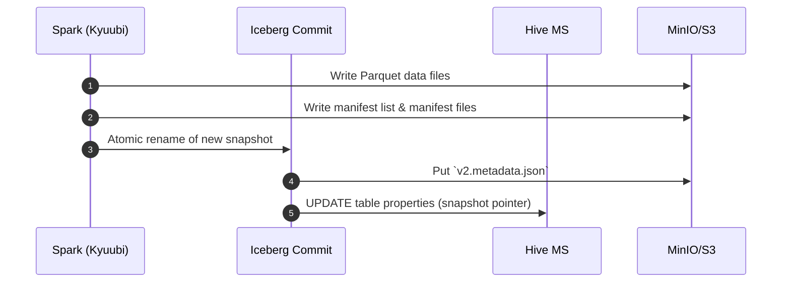

# ❄️ Lakehouse Architecture – Iceberg + MinIO + Hive Metastore

Konoha's data lake is powered by **Apache Iceberg** tables stored on a **MinIO (S3-compatible)** object store and catalogued in **Hive Metastore**.  This combination delivers ACID guarantees, time-travel, and schema evolution while remaining 100 % open-source and laptop-friendly.

---

## 1. Storage Layout

| Path | Purpose |
|------|---------|
| `s3a://warehouse/` | Root warehouse bucket (Iceberg default) |
| `s3a://warehouse/<db>.db/<table>/data/` | Parquet data files |
| `s3a://warehouse/<db>.db/<table>/metadata/` | Snapshot & manifest files |

Each namespace (`db`) maps 1-to-1 with a Hive database. MinIO bucket versioning is **off**—Iceberg snapshots track versions internally.

---

## 2. Catalog Configuration

```properties
# Spark / Kyuubi
spark.sql.catalog.spark_catalog=org.apache.iceberg.spark.SparkCatalog
spark.sql.catalog.spark_catalog.type=hive
spark.sql.catalog.spark_catalog.uri=thrift://hive-metastore:9083
spark.sql.catalog.spark_catalog.warehouse=s3a://warehouse/

# Trino
catalog.name=iceberg
warehouse=s3a://warehouse
hive.metastore.uri=thrift://hive-metastore:9083
```

Why Hive catalog? It keeps metadata in MariaDB, letting Trino and Spark share snapshots without extra services.

---

## 3. Write Path (Spark / Kafka Connect)



Iceberg uses **atomic rename** (on the metadata JSON) so commits are O(1) regardless of table size.

---

## 4. Read Path (Trino)

1. Trino retrieves the current snapshot ID from Hive.  
2. Reads manifest list → manifest files → filtered Parquet splits.  
3. Column pruning & predicate pushdown happen before any data touches the network.

With Iceberg's **split planning**, even TB-scale tables respond in milliseconds for `SELECT COUNT(*)`-style queries.

---

## 5. Maintenance Tasks

| Task | Frequency | Command |
|------|-----------|---------|
| **Expire snapshots** | Daily | `CALL iceberg.system.expire_snapshots('sales.orders', RETAIN_LAST => 7);` |
| **Rewrite manifests** | Weekly | `CALL iceberg.system.rewrite_manifests('sales.orders');` |
| **Compaction (rewrite_data_files)** | When small files accumulate | `CALL iceberg.system.rewrite_data_files('<table>', MIN_INPUT_FILES => 50);` |

Automate via Airflow DAGs to keep storage healthy.

---

## 6. Schema Evolution Matrix

| Change Type | Supported? | Notes |
|-------------|-----------|-------|
| Add column (end) | ✅ | No rewrite needed |
| Rename column | ✅ | Tracked via field IDs |
| Drop column | ✅ | Marked as `deleted` in schema |
| Change column type | ⚠️ | Must be compatible (e.g., `int` → `long`) |
| Reorder columns | 🚫 | Iceberg ignores order; use selects |

Iceberg relies on **field IDs**, so renames don't break downstream queries like they do in Hive.

---

## 7. Partitioning Guidelines

1. Prefer **identity** transforms on high-cardinality columns (e.g., `order_date`).
2. Avoid over-partitioning; shoot for 100–500 MB per partition.
3. Use **bucket(x, N)** for heavy join keys to reduce skew.
4. Partition specs are versioned—evolve them as data grows (`ALTER TABLE … WRITE ORDERED BY`).

---

## 8. Security & Governance

* **S3 Credentials** – injected via Vault, rotated without table downtime.
* **Row-level security** – implement in Trino with Ranger or Trino built-in rules.
* **GDPR Deletes** – use `DELETE FROM <table> WHERE user_id=…` ; `positionDeletes` keep the operation metadata-only.

---

## 9. Future Enhancements

1. **Iceberg REST Catalog** – decouple from Hive MS for cloud object storage locks.
2. **Partition Evolution Automation** – auto-switch to `hour` granularity when daily partitions exceed 10 K files.
3. **View lineage** – integrate OpenLineage for Spark & Trino.

---

Back to [Architecture Overview](overview.md) 