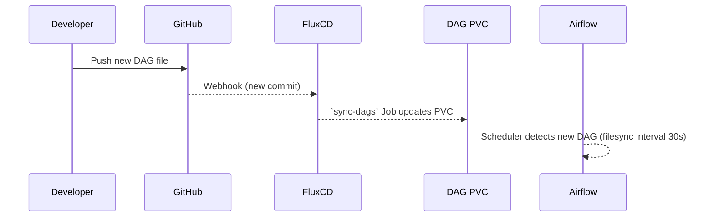

# 📜 Orchestration Architecture – Apache Airflow on Kubernetes

This page describes how Konoha schedules and monitors data workflows using **Apache Airflow 2.7** on Kubernetes and how DAG code flows from Git into the cluster.

---

## 1. Deployment Topology

```mermaid
graph TD
  subgraph Namespace: airflow
    Web[Airflow Webserver]
    Scheduler[Scheduler]
    Workers[Worker Deployment (K8sExecutor)]
    Triggerer[Triggerer]
    Flower[Flower]
  end
  Web <---> Scheduler
  Scheduler --> Workers
  Scheduler --> Triggerer
  Scheduler -->|metrics| Prom(exporter)
```

* **Kubernetes Executor** – Each task runs in its own short-lived pod; no Celery/RabbitMQ required.
* **Single PVC** (`airflow-dag-pvc`) mounted read-only to all pods for DAG distribution.
* **Prometheus Exporter** side-car exposes `/metrics` on every core component.

---

## 2. DAG Code Lifecycle



### `sync-dags.sh`

```bash
#!/bin/bash
set -euo pipefail
rsync -av --delete dag/ /mnt/dags
```

Flux executes this script in a **Kubernetes Job** each time the Git source changes. For faster local iteration you can also run:
```bash
./sync-dags.sh          # copies DAGs into the Minikube PVC via rsync+kubectl cp
```

---

## 3. Secrets & Connections via Vault

| Secret Path (Vault) | Mounted File | Airflow Usage |
|--------------------|-------------|---------------|
| `kyuubi/database`  | `/etc/airflow/kyuubi.env` | Spark JDBC in DBT tasks |
| `postgres/airflow` | `/etc/airflow/pg.env`    | Airflow metadata DB creds |
| `slack/webhook`    | `/etc/airflow/slack.env` | Alerting callback |

An **init-container** renders `airflow.cfg` by sourcing these env files, keeping sensitive tokens out of the image.

---

## 4. Scaling & Fault-Tolerance

1. **Parallelism** – `airflow.cfg` sets `parallelism = 64`, `dag_concurrency = 16`.
2. **Kubernetes Executor defaults** – task pods request `cpu=500m,memory=1Gi` and can be overridden per task with `@task(kubernetes_resources=…)`.
3. **Auto-heal** – RestartPolicy `OnFailure` restarts crashed Scheduler/Web pods in <10 s.
4. **High Availability** – Optionally enable 2× Scheduler replicas with Database lock (set in `helm/values.yaml`).

---

## 5. Monitoring & Alerting

| Signal | Source | Grafana Panel |
|--------|--------|---------------|
| DAG run duration | Prometheus exporter | `Airflow DAG Duration` |
| Scheduler heartbeat | `/metrics` | `Scheduler Heartbeat` |
| Task failures | Prometheus alert | Slack `#airflow-alerts` |

Example PrometheusRule:
```yaml
- alert: AirflowTaskFailure
  expr: airflow_task_failures_total > 0
  for: 5m
  labels:
    severity: critical
  annotations:
    summary: Airflow task failure detected
    description: "Job {{ $labels.dag_id }} failed {{ $value }} times"
```

---

## 6. Best-Practice DAG Patterns

1. **TaskFlow API** – Use `@task` decorators; avoids XCom boilerplate.
2. **KubernetesPodOperator** – For container-native jobs that need extra binaries.
3. **Dynamic DAGs** – Generate DAGs programmatically from YAML under `dag/config/`.
4. **Retry + Alerts** – Always configure `retries`, `retry_delay` and `email_on_failure=False` (we rely on Slack alerts instead).
5. **Backfills** – Trigger with `airflow dags backfill` CLI; K8sExecutor automatically pods-out parallel dates.

---

## 7. CI/Lint Pipeline

GitHub Actions workflow `ci-dag-lint.yml`:
```yaml
steps:
  - uses: actions/checkout@v4
  - name: Validate DAGs
    run: |
      pip install apache-airflow==2.7.2 black flake8
      black --check dag/
      python -m airflow dags list --safe-mode-off
```
Blocks merge if DAG import errors exist.

---

## 8. Future Enhancements

1. **Deferrable Operators** – Reduce scheduler load for I/O waits.
2. **Dagster Bridge** – Evaluate Dagster-to-Airflow shim for hybrid pipelines.
3. **OpenLineage Integration** – Emit lineage to Marquez for DAG transparency.

---

Back to [Architecture Overview](overview.md) 