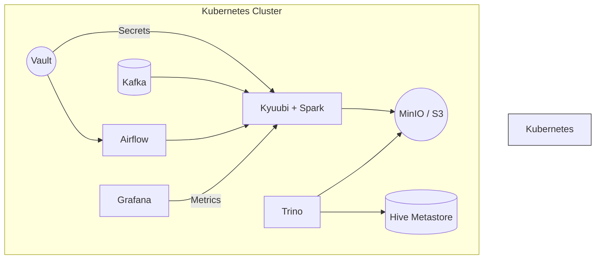
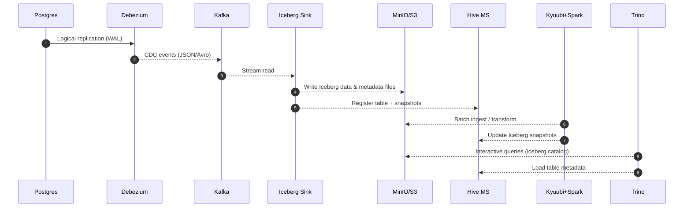
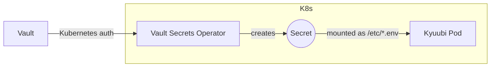
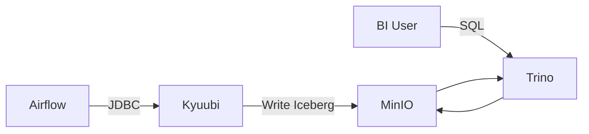

# 🏗️ Platform Architecture – Bird's-Eye View

Above is the minimal data-flow diagram; detailed component pages break down internals.

---

## Layers

| Layer | Purpose | Key Projects |
|-------|---------|--------------|
| **Storage** | Object store & schemas | MinIO, Hive Metastore |
| **Compute** | Batch & interactive SQL | Spark, Kyuubi |
| **Modeling** | Transformation logic | DBT inside Kyuubi |
| **Streaming** | Change Data Capture | Debezium, Kafka Connect |
| **Orchestration** | Scheduling | Apache Airflow |
| **Access** | Federated queries & BI | Trino, Metabase |
| **Security** | Secrets & auth | Vault, Keycloak |
| **Ops** | GitOps, metrics | FluxCD, Grafana |

---

## Design Principles & Strengths

1. **Laptop-first, cloud-native** – every service (including object store & Vault) runs inside a single Minikube cluster; no external SaaS required.
2. **Lakehouse core with ACID guarantees** – Apache Iceberg tables on MinIO give snapshot isolation, schema evolution and time-travel.
3. **Multi-tenant Spark** – Kyuubi turns Spark into a stateless JDBC service; USER vs SERVER share-level delivers both isolation and fast start-up.
4. **Real-time ingestion** – Debezium streams database changes through Kafka Connect directly into Iceberg without landing files.
5. **GitOps everything** – Terraform lays the ground, FluxCD keeps the cluster in sync with every `git push`.
6. **Zero plaintext secrets** – Vault-Secrets-Operator injects ephemeral secrets as mounted files; no credentials live in Git.

---

## CDC-First Ingestion vs. Snapshot Imports

While many lakehouse demos rely on periodic *full snapshots* (dump → copy → load), Konoha intentionally doubles-down on **Change Data Capture (CDC)** for operational sources.

| Aspect | Full Snapshot | CDC Stream (Chosen) |
|--------|---------------|---------------------|
| DB Impact | Long-running `pg_dump` locks, high I/O | Low overhead logical replication slot |
| Latency  | Hours to refresh | Seconds (near real-time) |
| Failure Blast Radius | Re-ingest ≈ full copy of N GB | Resume from last WAL offset |
| Merge Logic | Expensive `MERGE`/`DELETE` on lake | Upsert handled by Iceberg sink |
| Scalability | Linearly proportional to DB size | Proportional to change volume |

Snapshots remain available as **one-time bootstrap** when table history is missing, but production pipelines always switch to streaming once the initial snapshot is complete.

Iceberg's copy-on-write model plus hidden delete/insert manifests give us safe, idempotent upserts—no risk of duplicate rows even under at-least-once delivery.

---

## End-to-End Data Lifecycle

---

## Component Interaction Highlights

### Secret Propagation

*Pods never see Vault tokens; VSO handles renewal and rotation.*

*Detailed guide:* [Vault Secrets Operator](../components/vault-secrets-operator.md)

### GitOps Workflow

1. Developer commits Helm/Kustomize change ➜ `git push`.
2. **FluxCD Source** detects new revision.
3. **Kustomization** reconciles, applies manifests ➜ new pods roll.
4. Grafana alerts on rollout failures.

---

## Compute & Query Pattern – No More "ETL vs BI" Collisions

| Workload Type | Entry Point | Runtime | Scaling Knobs |
|---------------|------------|---------|---------------|
| Heavy transforms / DBT models | Kyuubi (JDBC) or Airflow task | Spark on K8s | `spark.executor.*`, `dynamicAllocation.*`, *USER* vs *SERVER* share-level |
| Interactive / ad-hoc analytics | Trino (ANSI SQL) | Trino worker pods | `task.max-memory`, `query.max-memory`, pod `resources.requests/limits` |

*Why it matters*

1. **Resource isolation** – Spark driver & executors run in their own pods; Trino workers are separate Deployment. A runaway ETL can autoscale up to 9 executors without starving BI users.
2. **Instant freshness** – Iceberg snapshots written by Spark are immediately visible to Trino; no compaction or copy phases.
3. **Configuration flexibility** – Kyuubi USER share-level gives each DBT invocation its own Spark app, so you can fine-tune memory/cores per job via Vault-managed `spark.env`.
4. **Cost efficiency** – Trino reads Parquet files directly, so simple dashboards don't spin up Spark, saving CPU.

---

## Where to Go Next

* **Compute pipeline:** [compute.md](compute.md)
* **Lakehouse internals:** [lakehouse.md](lakehouse.md)
* **Workflow orchestration:** [orchestration.md](orchestration.md) 