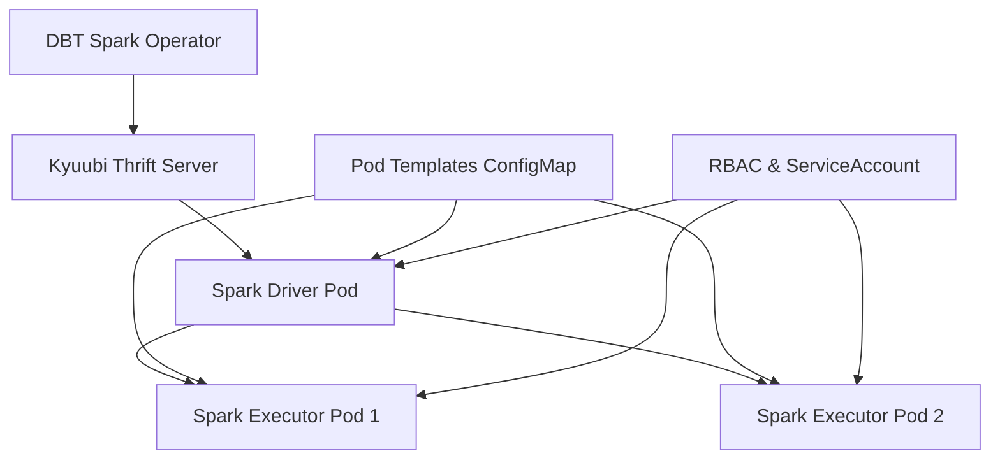

# Kyuubi with Lightweight Spark Pod Templates

## Overview
This Kyuubi deployment is configured for **lightweight DBT execution** using custom Kubernetes pod templates. It provides optimized resource allocation for DBT Spark workloads with proper pod naming and lifecycle management.

## Architecture



## Lightweight Resource Configuration

### 🚀 **Spark Resource Limits**
- **Driver Pod**: 0.5 CPU, 1GB RAM
- **Executor Pods**: 0.5 CPU, 1GB RAM each
- **Default Executors**: 2 instances
- **Total Resources**: ~1.5 CPU, 3GB RAM per DBT job

### 📦 **Pod Templates**
Custom pod templates are defined in ConfigMaps:
- `spark-driver-template`: Driver pod configuration
- `spark-executor-template`: Executor pod configuration

## Pod Naming Convention

When DBT jobs execute via Kyuubi, Spark pods are created with predictable names:

```
# Driver Pod
dbt-spark-driver-<session-id>-driver

# Executor Pods  
dbt-spark-<session-id>-exec-1
dbt-spark-<session-id>-exec-2
```

## Kyuubi Spark Configuration

### **Key Environment Variables**

```yaml
# Resource Configuration
KYUUBI_ENGINE_SPARK_CONF_SPARK_EXECUTOR_INSTANCES: "2"
KYUUBI_ENGINE_SPARK_CONF_SPARK_EXECUTOR_MEMORY: "1g"
KYUUBI_ENGINE_SPARK_CONF_SPARK_EXECUTOR_CORES: "0.5"
KYUUBI_ENGINE_SPARK_CONF_SPARK_DRIVER_MEMORY: "1g"
KYUUBI_ENGINE_SPARK_CONF_SPARK_DRIVER_CORES: "0.5"

# Pod Templates
KYUUBI_ENGINE_SPARK_CONF_SPARK_KUBERNETES_DRIVER_PODTEMPLATESFILE: "/opt/spark/pod-templates/driver-template.yaml"
KYUUBI_ENGINE_SPARK_CONF_SPARK_KUBERNETES_EXECUTOR_PODTEMPLATESFILE: "/opt/spark/pod-templates/executor-template.yaml"

# Pod Naming
KYUUBI_ENGINE_SPARK_CONF_SPARK_KUBERNETES_EXECUTOR_PODNAMEPREFIX: "dbt-spark"
KYUUBI_ENGINE_SPARK_CONF_SPARK_KUBERNETES_DRIVER_PODNAMEPREFIX: "dbt-spark-driver"

# Kubernetes Integration
KYUUBI_ENGINE_SPARK_CONF_SPARK_MASTER: "k8s://https://kubernetes.default.svc:443"
KYUUBI_ENGINE_SPARK_CONF_SPARK_KUBERNETES_NAMESPACE: "kyuubi"
```

## Pod Template Features

### **Driver Pod Template**
- **Service Account**: `kyuubi-sa` (full RBAC permissions)
- **Resource Limits**: 500m CPU, 1Gi memory
- **Image**: `spark-engine-iceberg:3.5.0-1.4.2`
- **Node Selector**: Linux nodes only
- **Tolerations**: Data platform workload tolerations

### **Executor Pod Template**
- **Service Account**: `kyuubi-sa`
- **Resource Limits**: 500m CPU, 1Gi memory
- **Image**: `spark-engine-iceberg:3.5.0-1.4.2`
- **Lifecycle**: Automatic cleanup after completion
- **Scheduling**: Optimized for data platform nodes

## Integration with DBT Spark Operator

The DBT Spark Operator leverages this configuration:

```python
# Example usage in DAG
run_staging_models = DbtSparkRunOperator(
    task_id='run_staging_models',
    select='tag:staging',
    target='dev',
    vars={'warehouse_path': 's3a://warehouse/dev'},
    dag=dag
)
```

### **Execution Flow**
1. **DAG Trigger**: Airflow triggers DBT Spark Operator
2. **Pod Creation**: Operator creates DBT execution pod
3. **Kyuubi Connection**: DBT connects to Kyuubi Thrift server
4. **Spark Submission**: Kyuubi submits Spark jobs using pod templates
5. **Resource Allocation**: Lightweight pods (0.5 CPU, 1GB RAM each)
6. **Job Execution**: DBT models execute against Spark/Iceberg
7. **Cleanup**: Pods automatically terminate after completion

## Monitoring & Observability

### **Pod Labels**
All Spark pods include standardized labels:
```yaml
labels:
  app.kubernetes.io/name: spark
  app.kubernetes.io/component: driver|executor
  app.kubernetes.io/part-of: dbt-pipeline
  workload-type: spark-driver|spark-executor
```

### **Resource Monitoring**
- **CPU Usage**: ~0.5 cores per pod
- **Memory Usage**: ~1GB per pod
- **Pod Count**: 3 pods per DBT job (1 driver + 2 executors)
- **Lifecycle**: Short-lived (minutes, not hours)

## Node Scheduling

### **Node Selection**
```yaml
nodeSelector:
  kubernetes.io/os: linux

tolerations:
- key: "workload-type"
  operator: "Equal"
  value: "data-platform"
  effect: "NoSchedule"
```

### **Resource Planning**
For optimal performance:
- **Small Models**: 2 executors sufficient
- **Large Models**: Can scale executors via configuration
- **Concurrent Jobs**: Multiple DBT tasks can run simultaneously
- **Node Capacity**: Plan for ~1.5 CPU, 3GB RAM per concurrent job

## Configuration Customization

### **Scaling Executors**
To adjust executor count per job:
```yaml
# In Kyuubi deployment
KYUUBI_ENGINE_SPARK_CONF_SPARK_EXECUTOR_INSTANCES: "4"  # Scale to 4 executors
```

### **Resource Adjustments**
For heavier workloads:
```yaml
# Increase memory allocation
KYUUBI_ENGINE_SPARK_CONF_SPARK_EXECUTOR_MEMORY: "2g"
KYUUBI_ENGINE_SPARK_CONF_SPARK_DRIVER_MEMORY: "2g"
```

### **Dynamic Configuration**
DBT Spark Operator supports runtime overrides:
```python
# Override resources for specific models
heavy_model = DbtSparkRunOperator(
    task_id='run_heavy_model',
    models=['large_aggregation'],
    config=DbtSparkConfig(
        cpu_limit="1000m",
        memory_limit="2Gi"
    ),
    dag=dag
)
```

## Troubleshooting

### **Common Issues**

1. **Pod Scheduling Failures**
   - Check node selector and tolerations
   - Verify resource availability on nodes

2. **Template Not Found**
   - Ensure ConfigMaps are created in kyuubi namespace
   - Check volume mounts in Kyuubi deployment

3. **RBAC Permissions**
   - Verify `kyuubi-sa` has pod creation permissions
   - Check service account binding

### **Debugging Commands**
```bash
# Check pod templates
kubectl get configmaps -n kyuubi | grep spark-template

# Monitor Spark pods
kubectl get pods -n kyuubi -l app.kubernetes.io/name=spark

# Check Kyuubi logs
kubectl logs -n kyuubi deployment/kyuubi-dbt -f

# View pod template content
kubectl get configmap spark-driver-template -n kyuubi -o yaml
```

This configuration provides a **lightweight, scalable foundation** for DBT Spark execution while maintaining proper resource governance and observability. 